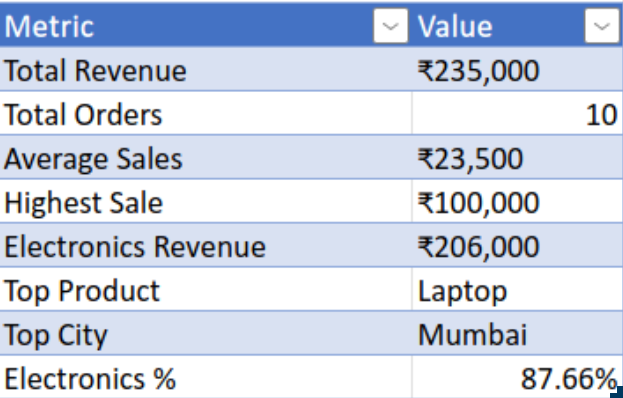
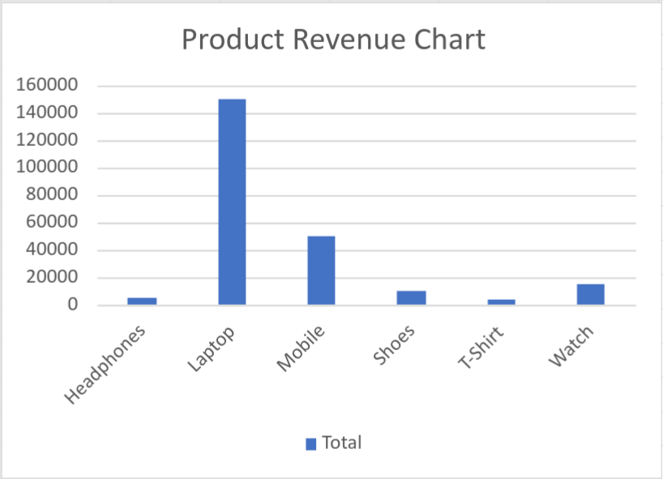
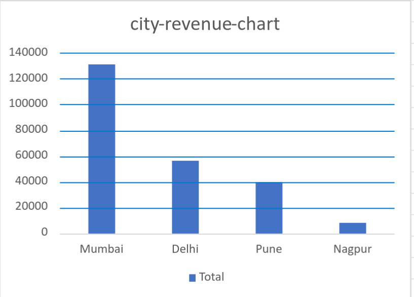

# 📊 E-Commerce Sales Dashboard (Excel)

## 🚀 Project Overview

This project is an E-Commerce Sales Dashboard built using Microsoft Excel.

The dashboard analyzes sales performance across products, cities, and categories using Excel formulas, Pivot Tables, Pivot Charts, XLOOKUP, and Conditional Formatting.

The goal of this project was to learn practical Excel skills used by Data Analysts and create a portfolio-ready dashboard.

---

## 📸 Dashboard Preview

  

---

## 🎯 Business Objective

Analyze sales data to answer key business questions:

* What is the total revenue?
* Which city generates the highest revenue?
* Which product performs best?
* Which category contributes the most revenue?
* How can sales data be visualized effectively through dashboards?

---

## 📈 Key Insights

| Metric                           |    Value |
| -------------------------------- | -------: |
| Total Revenue                    | ₹235,000 |
| Total Orders                     |       10 |
| Average Sales                    |  ₹23,500 |
| Highest Sale                     | ₹100,000 |
| Electronics Revenue              | ₹206,000 |
| Top Product                      |   Laptop |
| Top City                         |   Mumbai |
| Electronics Revenue Contribution |   87.66% |

---

## 🏆 Product Revenue Analysis

  

### Insights

* Laptop generated the highest revenue.
* Laptop contributed approximately 64% of total revenue.
* Mobile was the second-best performing product.
* T-Shirt generated the lowest revenue.

---

## 🏙️ City Revenue Analysis

  

### Insights

* Mumbai generated the highest revenue.
* Delhi was the second-highest revenue contributor.
* Nagpur generated the lowest revenue.
* More than half of total revenue came from Mumbai.

---

## 🛠️ Excel Skills Used

### Data Analysis

* Data Cleaning
* Sorting
* Filtering
* Business KPI Calculation

### Excel Functions

* SUM
* AVERAGE
* COUNT
* MAX
* MIN
* IF
* COUNTIF
* SUMIF
* SUMIFS
* XLOOKUP

### Reporting & Visualization

* Pivot Tables
* Pivot Charts
* Conditional Formatting
* KPI Dashboard Design

---

## 📂 Project Files

* E-Commerce-Sales-Dashboard.xlsx
* dashboard.png
* product-revenue-chart.png
* city-revenue-chart.png
* README.md

---

## 📚 What I Learned

Through this project, I learned:

* Practical Excel for Data Analytics
* Building KPI Dashboards
* Sales Performance Analysis
* Business Insight Generation
* Data Visualization Techniques
* Using Pivot Tables and XLOOKUP in real-world scenarios

---

## 🔮 Future Improvements

* Add interactive slicers
* Create dynamic dashboards
* Connect external datasets
* Rebuild the dashboard in Power BI
* Analyze larger datasets using SQL and Python

---

## 👨‍💻 Author

**Mohammad Yasin Siddique**

Aspiring Data Analyst | Excel | SQL | Power BI | Python

---

⭐ If you found this project useful, feel free to star the repository.
